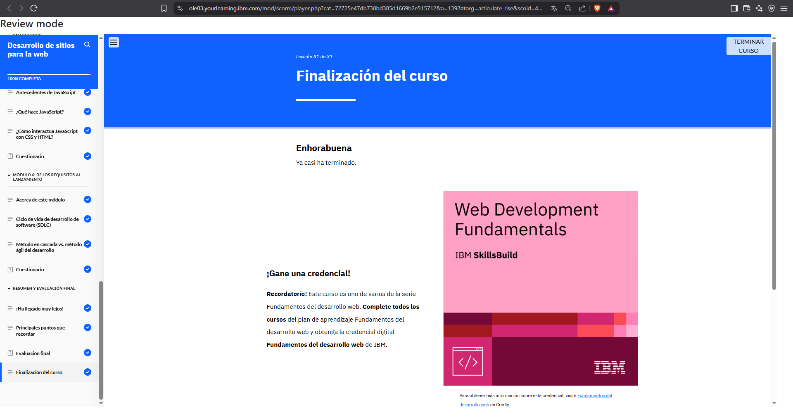
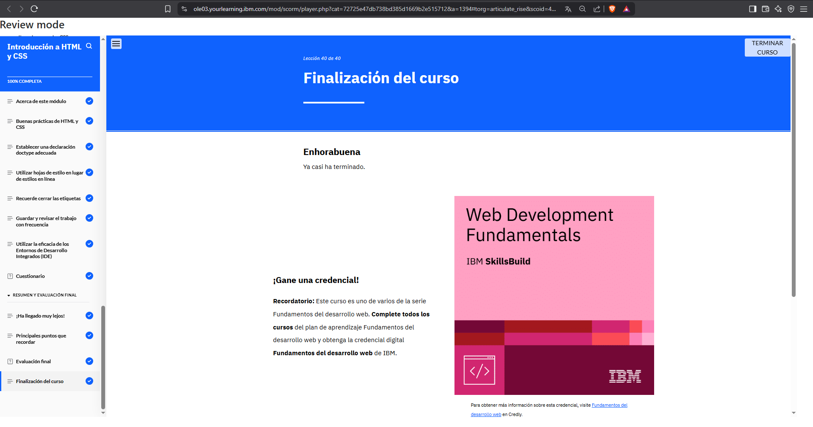
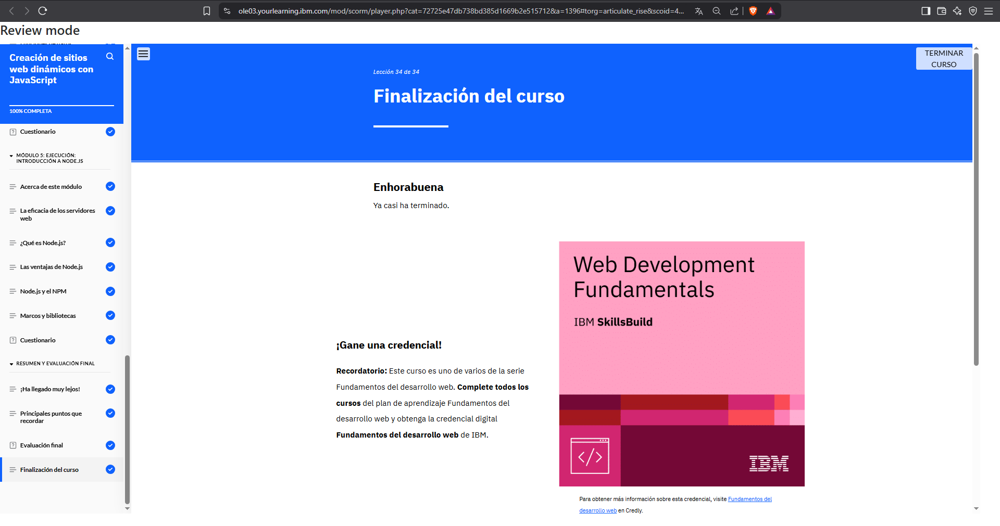
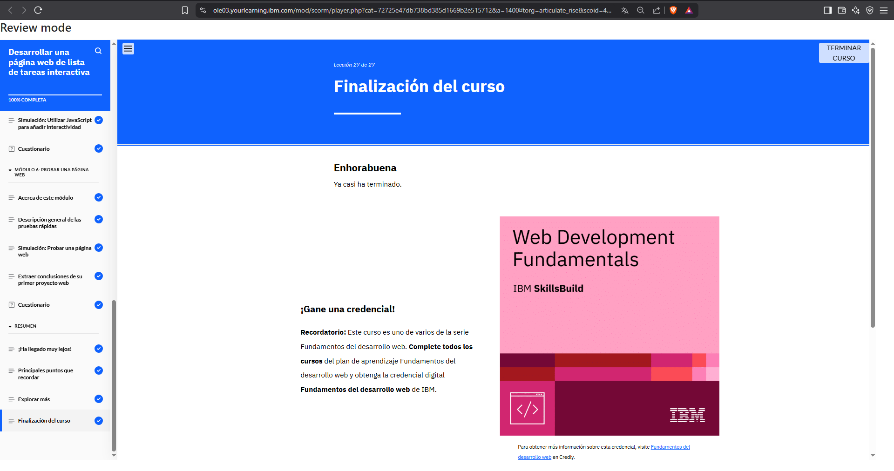
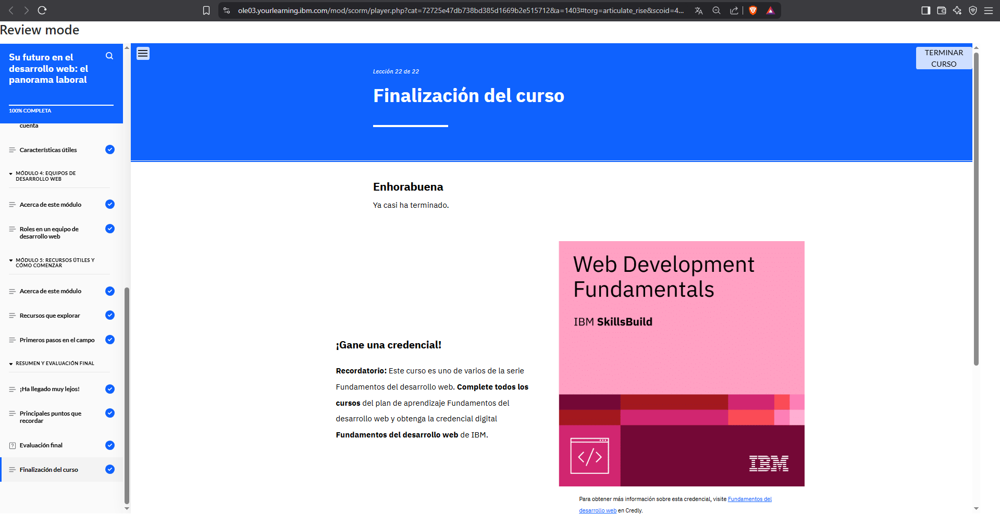
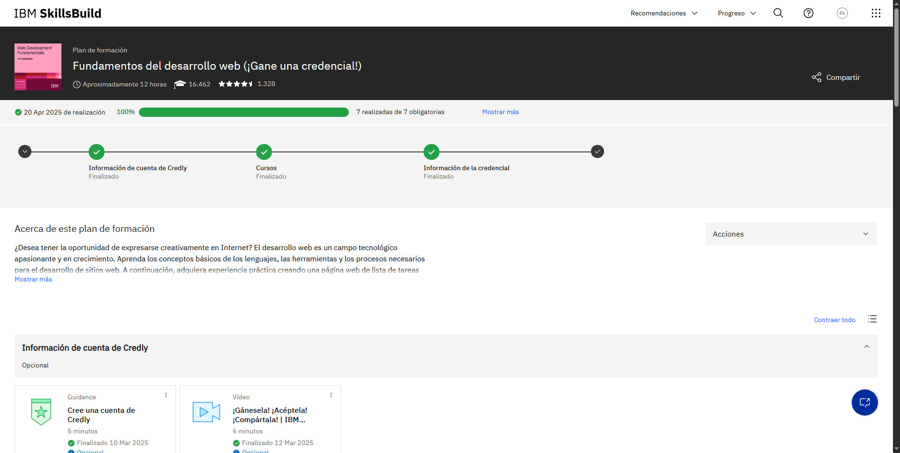

# Lo que Aprendí en Cada Módulo

### Módulo 1
Aprendí cómo funcionan los ordenadores a nivel básico y cómo estos conceptos están relacionados con el desarrollo web. Ahora sé diferenciar hardware de software, y entiendo la relación entre los navegadores, las páginas web y las aplicaciones web. También comprendí la diferencia entre la web y la Internet, y cómo los servicios en la nube ayudan a los desarrolladores a crear sitios más eficientes.

## Módulo 2: 
Aprendí cómo se construye y presenta una página web utilizando HTML para la estructura, CSS para el estilo y JavaScript para la interactividad. También entendí cómo estas tecnologías trabajan juntas para formar un sitio funcional. Además, conocí los enfoques metodológicos de desarrollo: el modelo en cascada y el ágil, y cómo Scrum permite trabajar en ciclos repetitivos y organizados.

### Módulo 3
Aprendí a construir páginas web con HTML bien estructurado y aplicar estilos con CSS para lograr un diseño limpio, responsivo y organizado.

### Módulo 4
Descubrí cómo usar JavaScript para hacer mis páginas dinámicas e interactivas. Además, entendí cómo conectar con bases de datos y usar Node.js para el backend.

### Módulo 5
Comprendí la importancia de probar y desplegar sitios web de forma profesional, automatizando procesos y garantizando calidad usando herramientas modernas y la nube.

### Módulo 6
Puse en práctica todos los conocimientos desarrollando una lista de tareas interactiva desde cero, combinando HTML, CSS, JS y pruebas funcionales.

### Módulo 7
Exploré el mercado laboral del desarrollo web, los distintos roles técnicos, las habilidades más valoradas y los recursos para continuar formándome en esta carrera.

### Final evidence

---
